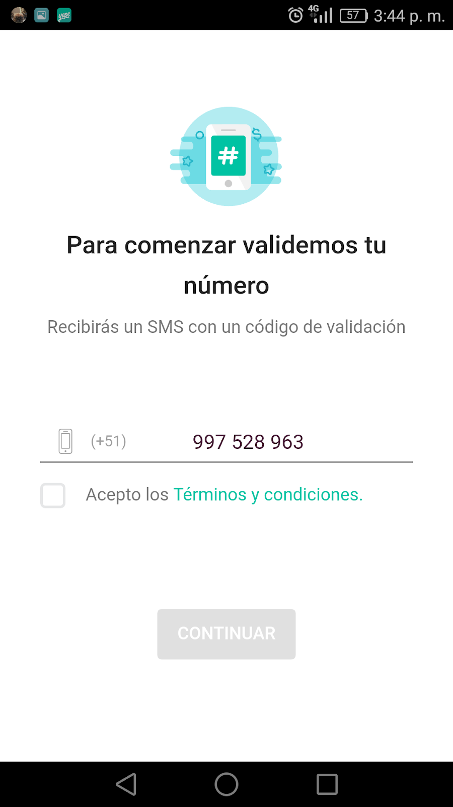
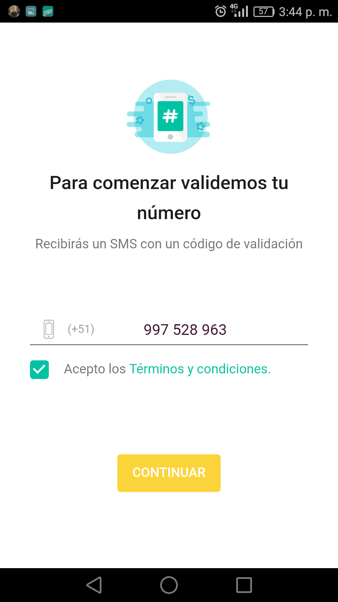
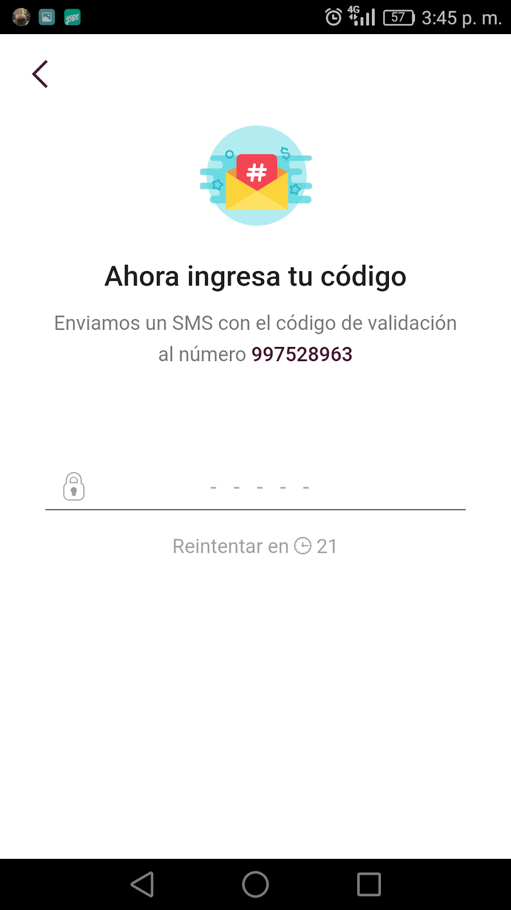
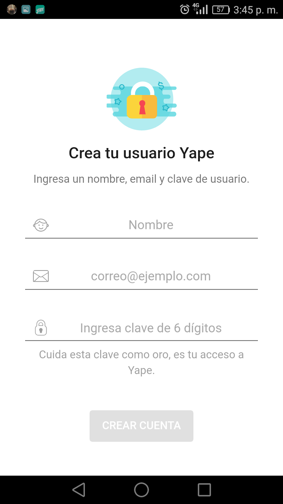
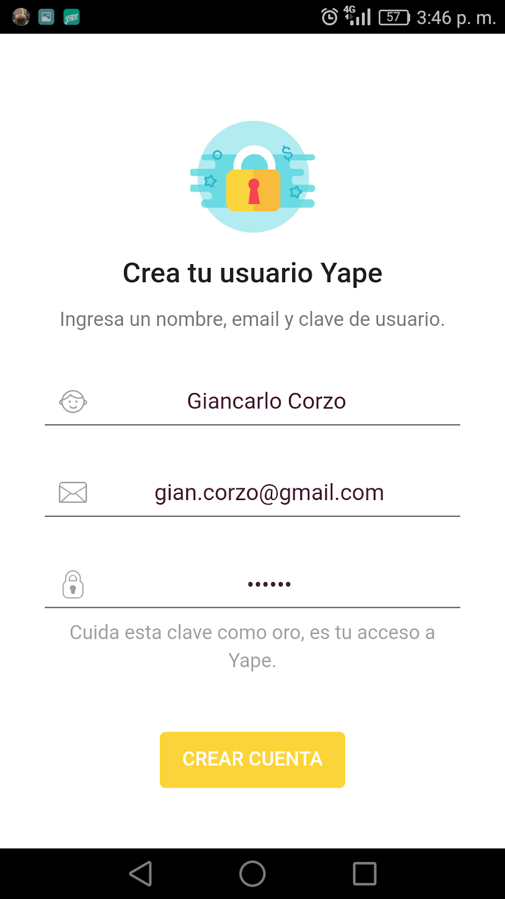
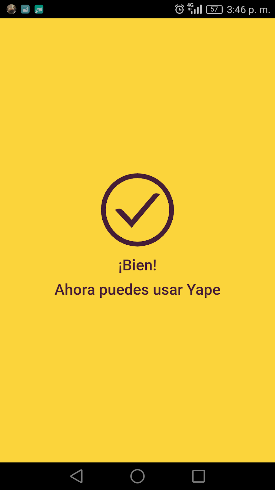
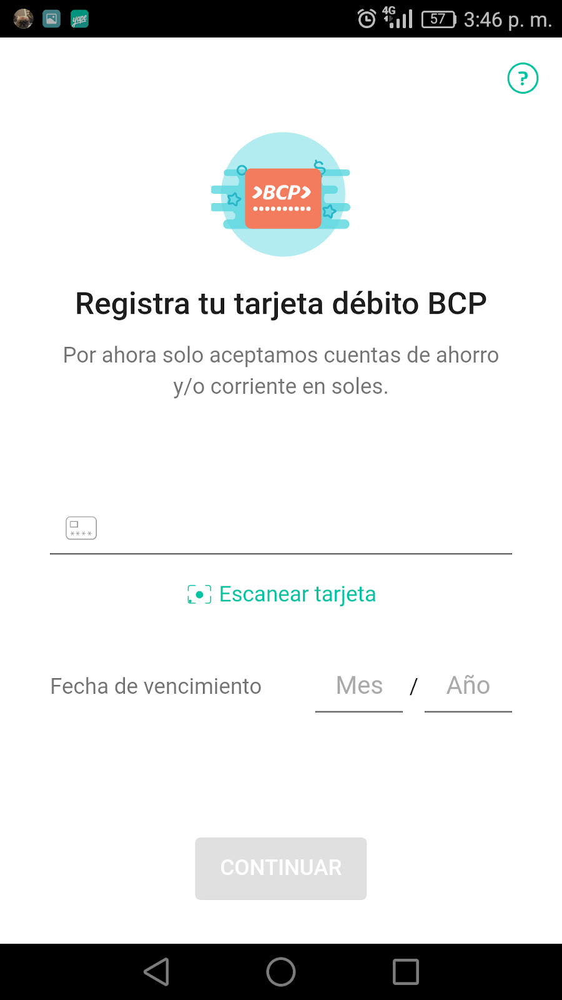
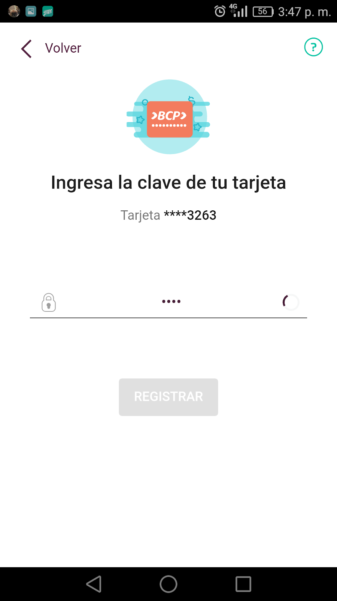

# Yape

## Requerimientos

## Pantalla 1 

* Debe tener un carrousel de íconos y un botón de registro

## Pantalla 2

* Debe poder ingresar un teléfono y poder aceptar los términos y condiciones
* El botón de continuar sólo se activa cuando un teléfono es ingresado y los términos aceptados

* Cuando se hace clic en continuar, el sistema debe enviar un request al API para registrar el teléfono y generar el código (los parámetros de envío son phone y terms. Los parámetros son case sensitive) 
Tener en cuenta que el API no permite más de 2 registros del mismo teléfono a la vez

## Pantalla 3

* Debe validar el código previamente generado en la pantalla anterior, el código es enviado mediante el API
* Al ingresar un código válido la pantalla, salta a la siguiente pantalla

* Debe haber un contador que a los 21 segundos llame al API para ingresar un nuevo código e invalidar el anterior

## Pantalla 4

* Debe poder ingresar mis datos de usuario
* Sólo cuando todos mis datos están ingresados se debe activar el botón amarillo
* Debe tener validaciones básicas (presencia de email, no formato de email, es decir, no es necesario REGEX) y la contraseña no debe poderse ver
* Al hacer clic sobre el botón, debe enviar los datos al API y cuando regresa, debe pasar a la pantalla 5

## Pantalla 5

* A los 3 segundos de mostrar esta pantalla, debe pasar a la siguiente

## Pantalla 6

* Debe poder registrar una nueva tarjeta de crédito
* Sólo debe poder ingresar 16 números en el input de tarjeta
* Sólo debe poder ingresar meses (01 al 12)
* Sólo debe poder ingresar años futuros (del 17 al 24) 
* El botón de registro sólo se activa si todos los campos han sido ingresados
* Una vez registrada la tarjeta se debe poder ingresar una contraseña de 4 números, esta no debe verse

## Pantalla 7

* Es la pantalla final a donde se llega después del registro. Esta pantalla no tiene funcionalidad activa: sólo debe mostrarse tal cual se ve

# Recursos
Encontraran todos los assets dentro de la carpeta `public/img` que tienen en éste repositorio.

Los colores utilizados son los siguientes:

Rojo - bullet : `#f64552`

Gris - bullet :` #f8f8f8`

Amarillo - botones: `#fbd43b`

Gris dark: `#212121`

Gris - letra soft: `#8f8f8f`

Turquesa - Términos y condiciones: `#00c3a3`

Morado - Entrada de números: `#49233b`

Morado light: `#451e36`

Morado dark: `#38052a`
